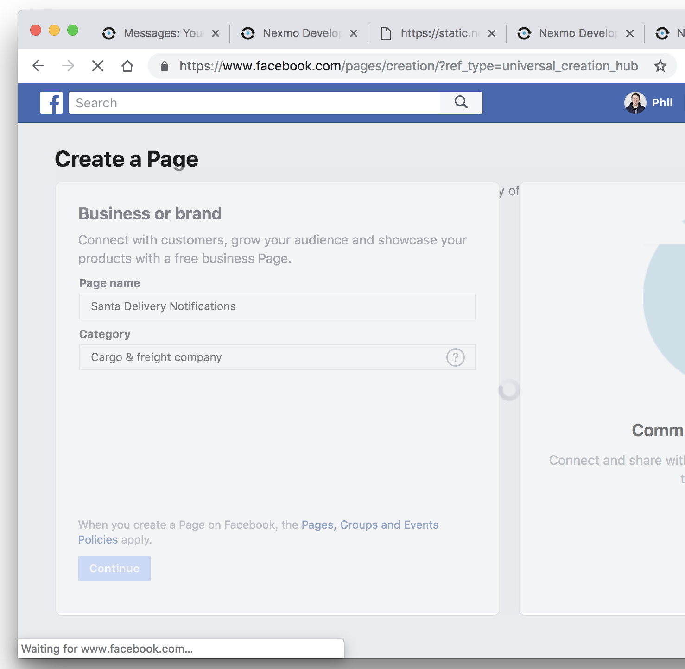
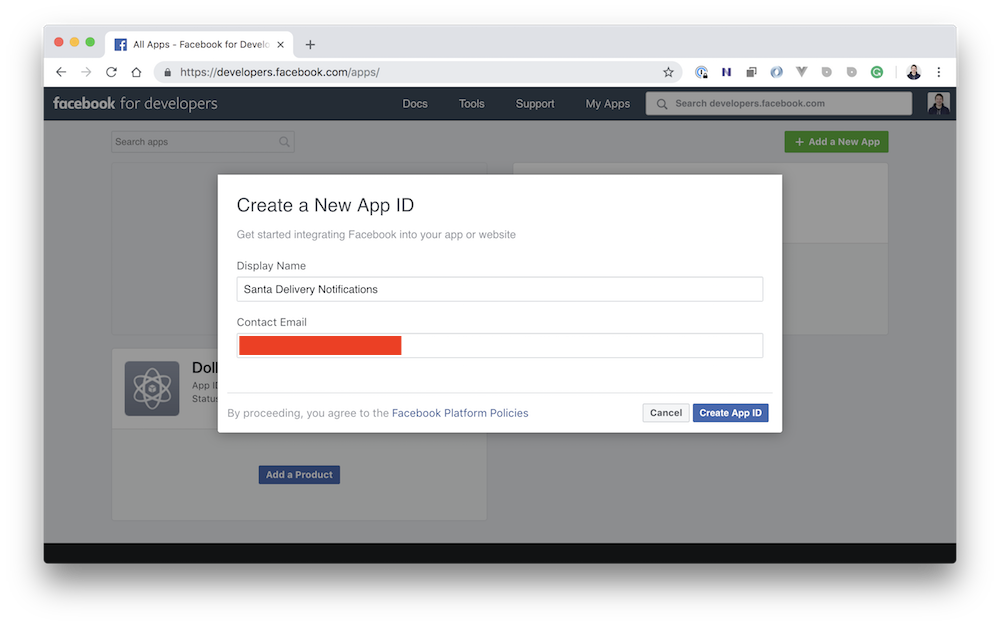
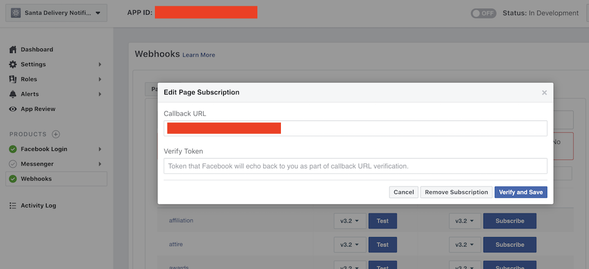
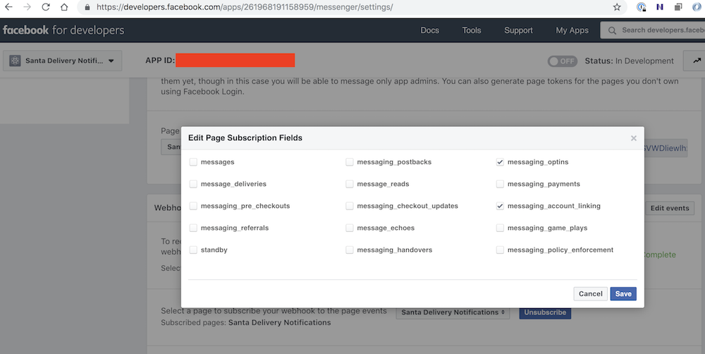

# Santa Delivery Notifications via Facebook Messenger with SMS Fallback using the Nexmo Dispatch API

The application show how to set up subscriptions for Santa Delivery Notifications. The user initally subscribes for notifications and later gets notifications when Santa has delivered presents to their locations. Notifications are sent via Facebook Messenger with fallback to SMS when the Facebook message is not read. Messaging is achived using the [Nexmo Dispatch API](https://developer.nexmo.com/dispatch/overview).


## Prerequisites

* A [Nexmo account](https://dashboard.nexmo.com/sign-up)
* An [mLab account](https://mlab.com/signup/)
* A Facebook account
* Install the [Nexmo CLI](https://github.com/Nexmo/nexmo-cli) used during the setup documented here
* An [Ngrok account](https://ngrok.com) for testing the application locally

## Setup

### Local application environment

Clone this repo.

Install dependencies and create a `.env` file.

```sh
$ npm install
cp .env-example .env
```

Get Ngrok running locally and tunnelling do port `1234` for the locally running application.

```sh
$ ngrok http 1234
```

Create a Nexmo application:

```sh
$ nexmo app:create "Santa Delivery Notifications App" \
https://NGROK_SUBDOMAIN.ngrok.io/inbound \
https://NGROK_SUBDOMAIN.ngrok.io/status \
--keyfile=private.key \
--type=messages
```

You can read more on this in the [How to create a Nexmo Messages and Dispatch Application documentation](https://developer.nexmo.com/messages/building-blocks/create-an-application).

Update the contents of `.env` with the required configuration values.

_Note: there are still some configuration values that will be required to be added once the Facebook setup steps are completed._

Run the application:

```sh
$ node server.js
```

### Facebook Page and App

Create a Facebook page:



Create a Facebook application associated with the Facebook page.



Set up the Facebook webhook with your Ngrok URL from earlier. When "Verify and Save" is clicked your webhook URL will be called. Note the code for echoing back the `hub.challenge` value is in place so the saving should complete.



Configure Facebook webhook events:



### Link Facebook Page to Nexmo

Generate a JWT for your Nexmo Application. Replace `YOUR_APP_ID` with your Nexmo Application ID:

```sh
$ JWT="$(nexmo jwt:generate ./private.key application_id=YOUR_APP_ID)"
echo $JWT
```

Link the Nexmo application with your Facebook page using the [Nexmo Facebook app linking page](https://static.nexmo.com/messenger/).

## License

MIT
